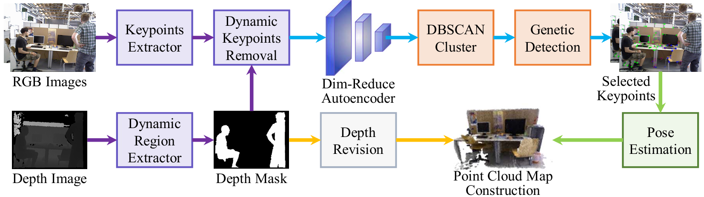

<div align="center">
<h3>GeneA-SLAM2: Dynamic SLAM with AutoEncoder-Preprocessed Genetic Keypoints Resampling and Depth Variance-Guided Dynamic Region Removal</h3>

<a href="https://arxiv.org/pdf/2506.02736"></a>
<a ></a>
[](https://github.com/qingshufan/GeneA-SLAM2/stargazers)
<a href="https://github.com/qingshufan/GeneA-SLAM2/network/members">

</a>  [](https://github.com/qingshufan/GeneA-SLAM2/issues) [](https://opensource.org/licenses/gpl-3-0)

[](https://paperswithcode.com/sota/semantic-slam-on-tum-rgb-d?p=genea-slam2-dynamic-slam-with-autoencoder)
[](https://paperswithcode.com/sota/semantic-slam-on-bonn-rgb-d-dynamic?p=genea-slam2-dynamic-slam-with-autoencoder)
<!--  -->
</div>

This paper introduces GeneA-SLAM2, an RGB-D SLAM system for dynamic environments. It eliminates dynamic object interference via depth statistical information and enhances keypoint distribution uniformity. Integrated with [NGD-SLAM](https://github.com/yuhaozhang7/NGD-SLAM), the system retains real-time performance without a GPU. Experimental results demonstrate that GeneA-SLAM2 maintains high accuracy in dynamic scenes compared to current methods.  

## News
- **2025-06-03:** Codes released!

## Our GeneA-SLAM datasets
We have collected the GeneA-SLAM RGB-D dataset compatible with the [TUM](https://cvg.cit.tum.de/data/datasets/rgbd-dataset/download) format using the  [ORBBEC Astra sensor](https://www.orbbec.com/products/structured-light-camera/astra-series/), including registered images, trajectories, and point clouds, which can be downloaded from [GeneA-SLAM](https://github.com/qingshufan/GeneA-SLAM).

## Prerequisites
GeneA-SLAM is developed based on [ORB-SLAM3](https://github.com/UZ-SLAMLab/ORB_SLAM3) and [NGD-SLAM](https://github.com/yuhaozhang7/NGD-SLAM). Tested on Ubuntu 18.04; compatible with other platforms. High-performance hardware is recommended for real-time stability. Below are the core dependencies (largely inherited from [ORB-SLAM3](https://github.com/UZ-SLAMLab/ORB_SLAM3) and [NGD-SLAM](https://github.com/yuhaozhang7/NGD-SLAM) with minor optimizations):

### PCL (Point Cloud Library)
For 3D point cloud processing, Install via package manager:
```
sudo apt-get install libpcl-dev
```
Or build from source: [Install Guide](https://github.com/PointCloudLibrary/pcl)  

### YOLO (Included in Thirdparty folder)  
It adopts the C++ version of the [YOLO-fastest](https://github.com/dog-qiuqiu/Yolo-Fastest.git) model from [hpc203/yolov34-cpp-opencv-dnn](https://github.com/hpc203/yolov34-cpp-opencv-dnn). The model configuration and pre-trained weights are stored in the *Thirdparty* folder and loaded via OpenCV.

### C++11 or C++0x Compiler
Requires a C++11-compatible compiler (for threading/chrono features).

### Pangolin
For visualization UI: [Install Guide](https://github.com/stevenlovegrove/Pangolin).  

### OpenCV ≥3.2  
For image processing: [Install Guide](http://opencv.org). 

### Eigen3 ≥3.1.0  
For linear algebra (required by g2o): [Install Guide](http://eigen.tuxfamily.org).  

### Thirdparty Libraries (Included)  
- **DBoW2**: Modified for improved place recognition.  
- **g2o**: Modified for optimized non-linear optimization.  
Both are in the `Thirdparty` folder (BSD licensed).  

## Python
Required to calculate the alignment of the trajectory with the ground truth. **Required Numpy module**.

* (win) http://www.python.org/downloads/windows
* (deb) `sudo apt install libpython2.7-dev`
* (mac) preinstalled with osx

### ROS (optional)
We recommend using the [automated tool](https://github.com/fishros/install) to install the **Melodic Desktop Full** version of the ROS system on **Ubuntu 18.04**. The step is optional.


## Building GeneA-SLAM2
```
git clone https://github.com/qingshufan/GeneA-SLAM2
```

We provide a script `build.sh` and `build_ros.sh` to build **GeneA-SLAM2**. 
```
cd GeneA-SLAM2
chmod +x build.sh
./build.sh
./build_ros.sh
```

## Running datasets

### Normal mode
Please modify the dataset path in the following script before running:
```bash
cd GeneA-SLAM2
./Examples/RGB-D/rgbd_tum Vocabulary/ORBvoc.txt Examples/RGB-D/TUM3.yaml [path] [path]/associations.txt
```

### ROS mode
We provide a ROS quick-run script. Before running, please modify **GeneA_SLAM2_PATH** (GeneA-SLAM path) and **ROSBAG_PATH** (ROS bag path) in the script. **PLAY_SPEED** (playback speed) depends on your computer's performance.
```bash
cd GeneA-SLAM2
chmod +x ros_run.sh
./ros_run.sh
```
## LICENSE

ORB-SLAM3 is released under a [GPLv3 license](https://github.com/UZ-SLAMLab/ORB_SLAM3/blob/master/LICENSE). So Our GeneA-SLAM2 are under the GPL-3.0 license.

## Acknowledgement
We adapted some codes from some awesome repositories including [ORB-SLAM3](https://github.com/UZ-SLAMLab/ORB_SLAM3), [NGD-SLAM](https://github.com/yuhaozhang7/NGD-SLAM) and [ORBSLAM2_with_pointcloud_map](https://github.com/gaoxiang12/ORBSLAM2_with_pointcloud_map.git) Thanks for making codes publicly available. 

## Citation

If you find this project useful, please consider citing:
```bibtex
@inproceedings{qing2024geneaslam2, 
      title={GeneA-SLAM2: Dynamic SLAM with AutoEncoder-Preprocessed Genetic Keypoints Resampling and Depth Variance-Guided Dynamic Region Removal}, 
      author={Shufan Qing and Anzhen Li and Qiandi Wang and Yuefeng Niu and Mingchen Feng and Guoliang Hu and Jinqiao Wu and Fengtao Nan and Yingchun Fan},
      journal={arXiv preprint arXiv:2506.02736},
      year={2025}
}
```